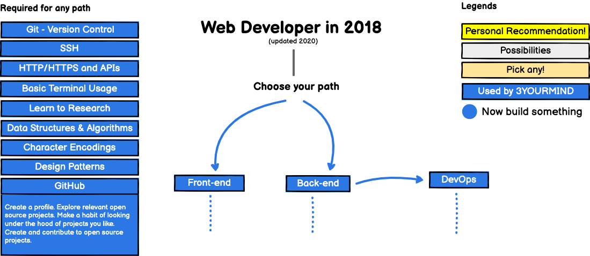
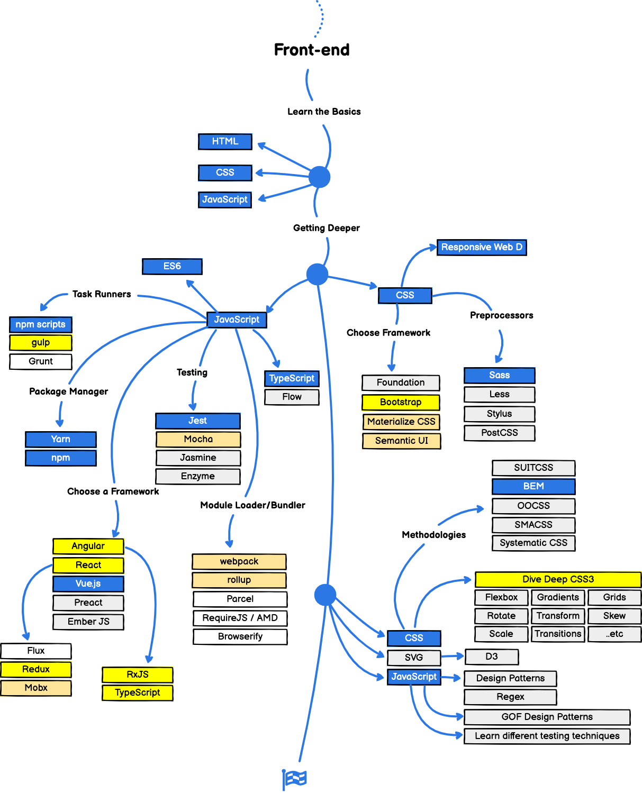
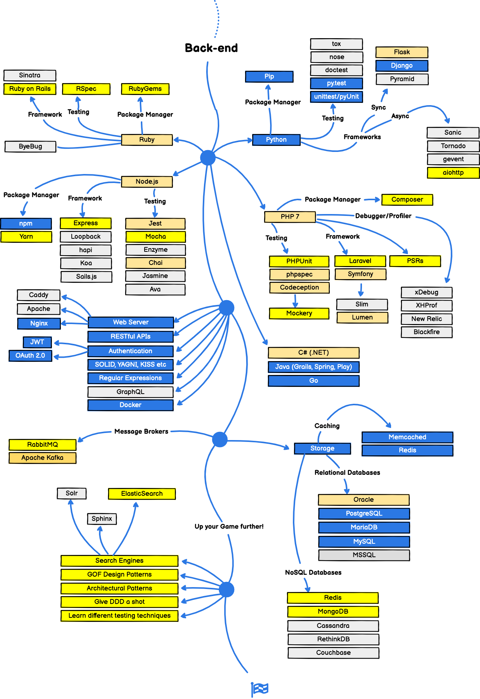

# 3YOURMIND Developer Roadmap

This project was forked from [here](https://github.com/kamranahmedse/developer-roadmap).

Technologies which are used by 3YOURMIND are marked in blue.

## 🚀 Introduction

## 🎨 Front-end Roadmap

## 👽 Back-end Roadmap

## 👷 DevOps Roadmap

 

## 👬 Contribution

The roadmaps are built using [Balsamiq](https://balsamiq.com/products/mockups/). Project file can be found at `/project-files` directory. To modify any of the roadmaps, open Balsamiq, click **Project > Import > Mockup JSON**, it will open the roadmap for you, update it, upload and update the images in readme and create a PR.		

## License

